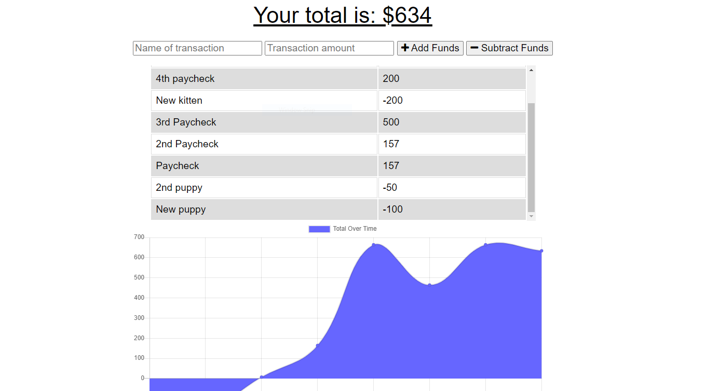

Online/Offline Budget Trackers

Tracy Torisky

ttorisky@gmail.com

The user has the ability to add transactions to their budget while offline, and have the transaction added when the app is back online.

The user enters the name and amount of transaction, and then adds or subtracts accordingly.  The new transaction shows up in the list of items.  

If the user enters this information and the app is offline, it will be saved to the indexDB and added to the list once back online.

